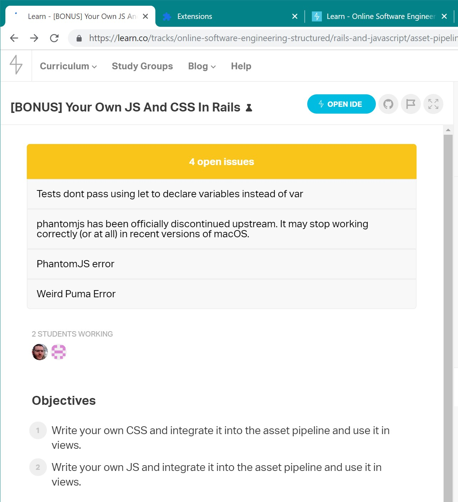

# learn-issues-extension

An extension for the Learn.co website. Adds a banner to the page, showing open issues.

When opening a lesson it will check github for any open issues in the current lesson It will then add a banner to the top of the page saying how many issues there are with a link to each one.

The banner is color coded based on how many issues are open. None is green, until five is yellow, five and more is red.

**Notice**: Currently the github api requests are rate limited to 60 requests per hour. Sometimes the extension by accident makes two requests, so this may come out to even less page loads before it stops working. This usually won't be an issue with normal usage.

## Instalation

[Install from the chrome web store](https://chrome.google.com/webstore/detail/learn-issues/jlngcabipfijndiahbnodbgepolahdin)

Install from master:
- Download this repository `git clone git@github.com:arye-dov-eidelman/learn-issues-extension.git`
- Navigate to `chrome://extensions/`.
- Enable __Developer mode__ if it's not already enabled.
- Click __Load unpacked__.
- Select the downloaded folder.

